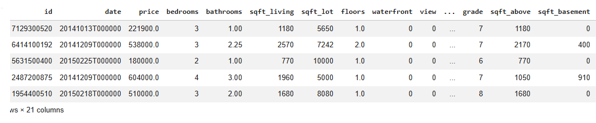
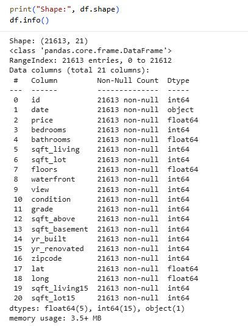
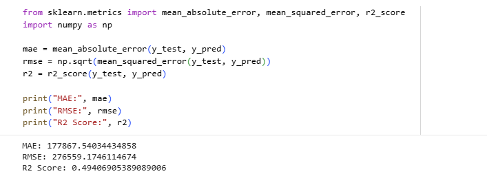
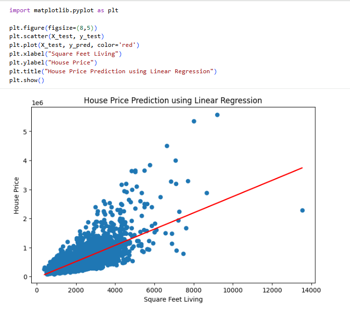

# House Price Prediction using Simple Linear Regression

## 📌 Project Overview

This project focuses on predicting house prices using Simple Linear Regression. The model is trained on the King County House Sales dataset and uses the living area of a house (`sqft_living`) to estimate its market price.

The objective of this project is to understand the fundamentals of regression analysis, data preprocessing, model training, evaluation, and visualization using Python and Machine Learning libraries.

---

## 🎯 Objective

To build a machine learning model that predicts house prices based on the living area of a house and evaluate its performance using standard regression metrics.

---

## 📊 Dataset

**Dataset:** House Sales in King County, USA

The dataset contains information about house sales, including:

* Price
* Number of bedrooms
* Number of bathrooms
* Living area (sqft_living)
* Lot area
* Floors
* Waterfront information
* Condition and grade
* Year built
* And other housing-related features

---

## 🛠 Technologies Used

* Python
* Pandas
* NumPy
* Scikit-learn
* Matplotlib
* Google Colab
* KaggleHub

---

## 🔄 Project Workflow

### 1. Data Collection

The dataset was downloaded directly from Kaggle using KaggleHub.

### 2. Data Exploration

* Loaded dataset using Pandas
* Inspected dataset structure
* Checked data types
* Verified missing values
* Generated summary statistics

### 3. Feature Selection

Selected:

* Independent Variable: `sqft_living`
* Target Variable: `price`

### 4. Data Splitting

The dataset was divided into:

* Training Set (80%)
* Testing Set (20%)

### 5. Model Training

A Simple Linear Regression model was trained using Scikit-learn.

### 6. Model Evaluation

The model performance was measured using:

* Mean Absolute Error (MAE)
* Root Mean Squared Error (RMSE)
* R² Score

### 7. Visualization

A regression plot was created to visualize the relationship between house size and house price.

---

## 📈 Results

Model Performance:

* Mean Absolute Error (MAE): 177,867.54
* Root Mean Squared Error (RMSE): 276,559.17
* R² Score: 0.4941

The model explains approximately 49.4% of the variation in house prices using the living area feature alone.

---

## 📷 Screenshots

### Dataset Preview

### Data Information

### Model Evaluation Metrics

### Prediction Graph

---

## 📁 Project Structure

house-price-prediction/

├── House_Price_Prediction.ipynb

├── README.md

└── screenshots/

    ├── dataset_preview.png

    ├── data_info.png

    ├── model_metrics.png

    └── prediction_graph.png

---

## ✅ Conclusion

This project successfully demonstrates the implementation of Simple Linear Regression for house price prediction. The model identifies the relationship between living area and house prices and provides practical experience in data analysis, machine learning, model evaluation, and visualization.

This project was completed as part of the Data Science Internship Program at Horizon Intern.
